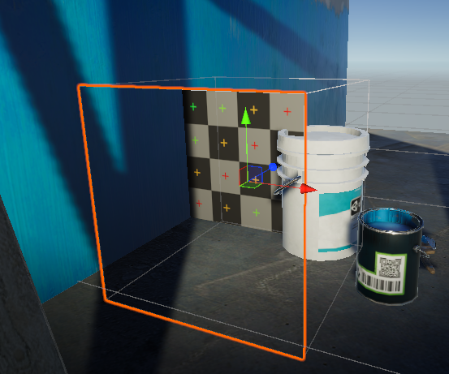
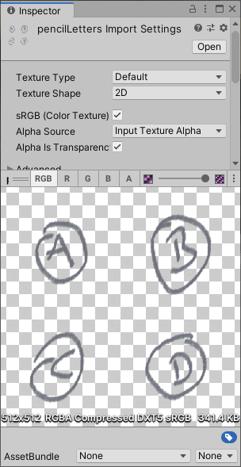
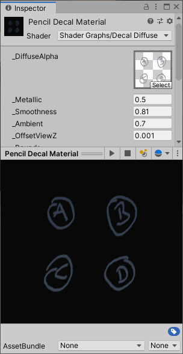
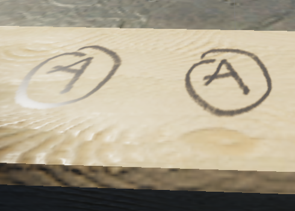
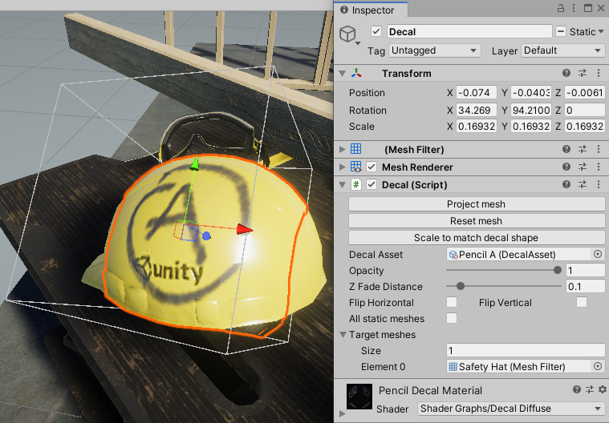
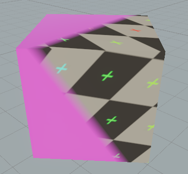
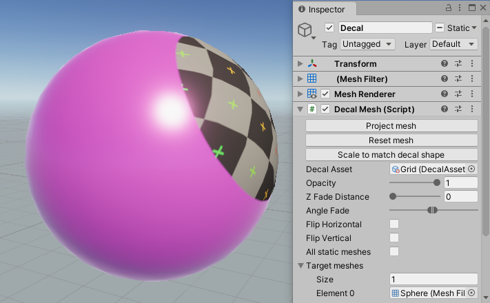
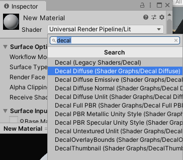
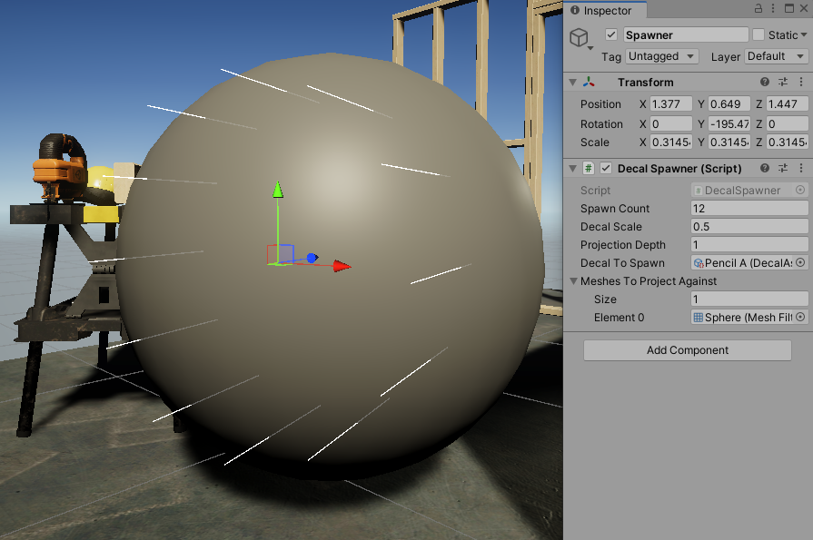
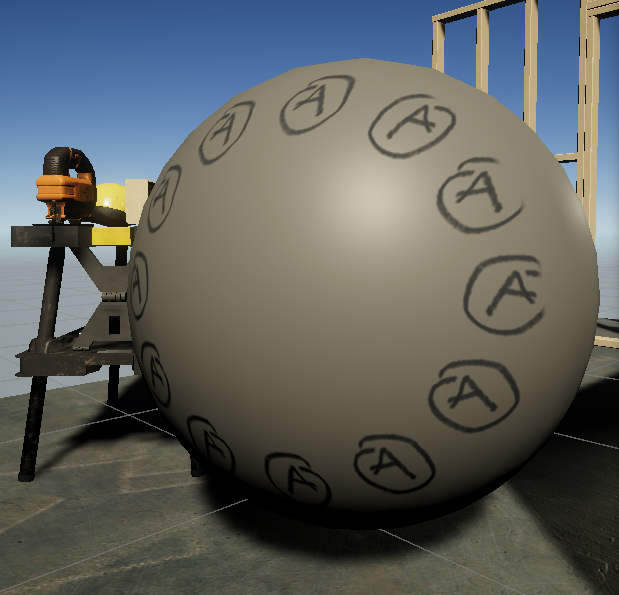

# Contents <!-- omit in toc -->
- [Key Features](#key-features)
- [Key Limitations](#key-limitations)
- [Changelog](#changelog)
- [Getting Started](#getting-started)
  - [Requirements](#requirements)
  - [Installation](#installation)
  - [Your First Decal](#your-first-decal)
- [Creating Your Own Decals](#creating-your-own-decals)
  - [1. Texture](#1-texture)
  - [2. Material](#2-material)
  - [3. DecalAsset](#3-decalasset)
  - [4. Decal object](#4-decal-object)
- [Overview](#overview)
  - [DecalMesh](#decalmesh)
    - [Projection Targets](#projection-targets)
    - [zFade](#zfade)
    - [Angle Fade](#angle-fade)
    - [Draw Order](#draw-order)
  - [DecalAsset](#decalasset)
  - [Material](#material)
- [Generating Decals at Runtime](#generating-decals-at-runtime)
- [Static Batching](#static-batching)
- [Baked Lighting](#baked-lighting)
- [Custom Shaders](#custom-shaders)
- [High Definition Render Pipeline](#high-definition-render-pipeline)
- [Future Work](#future-work)
- [Known Issues](#known-issues)
  - [`undeclared identifier 'GetWorldSpaceNormalizeViewDir'`](#undeclared-identifier-getworldspacenormalizeviewdir)
  - [Can only project against `MeshFilter` meshes](#can-only-project-against-meshfilter-meshes)
- [Licence](#licence)

# Driven Decals <!-- omit in toc -->
A mesh-based PBR decal system for Unity. For use with the Universal Render Pipeline's forward renderer.

There are broadly two approaches to rendering projected decals in real-time graphics:
* Generate a projected mesh for each decal instance in the scene.
* Dynamically project the decal in view-space using a fragment shader.

Each approach has its strengths and many projects benefit from using both for different situations. For example *Half-Life: Alyx* appears to use projected mesh decals for some static scenery details, and view-space projected decals for dynamic effects like bullet holes.

This decal system only deals with creating projected meshes, so you shouldn't expect it to be a complete solution to every decal use case.

[60 second introduction video.](https://www.youtube.com/watch?v=zFEtdRrD2D4)


## Key Features
* Creates meshes that behave like any other mesh in your scene. Making them easier to work with and use with other features.
* Easy to customise using Unity's Shader Graph.
* Low rendering cost and full compatibility with URP's forward renderer makes it ideal for use in XR.
* Custom inspectors that provide immediate in-editor feedback.
* Support for multi-object editing and undo.

## Key Limitations
* Decal mesh generation is relatively slow. This system is not recommended as a way to dynamically place bullet holes or other effects during gameplay.
* Once the decal mesh is generated it remains as it is and will not adapt to the other meshes changing. This system will not work nicely with skinned mesh renderers or other meshes that get distorted at runtime.

## Changelog
[Human-friendly changelog](CHANGELOG.md)

## Getting Started
### Requirements
* Unity 2019.3.0f6 or later, using the universal render pipeline (URP) version 7.2.1 or later.

In theory it should work in the LWRP and Unity versions as far back as 2018. But it looks like shader graph really doesn't care about cross-version compatibility. If you need this to work in those earlier versions I may be able to put together something compatible with some extra work. 

### Installation
1. Within your project open the Package Manager from *Window* → *Package Manager*
2. Click the **+** icon at the top-left of the window and select "Add package from git URL..."
3. Paste in `https://github.com/Anatta336/driven-decals.git` and click "Add"
4. Wait a minute. It looks a lot like nothing is happening, but Unity is busy thinking about packages.
5. When installed you'll see "Driven Decals" listed in the window.

**Or** you can manually modify your project's `manifest.json` file in the Packages folder to include:
```js
{
  "dependencies": {
    "com.samdriver.driven-decals": "https://github.com/Anatta336/driven-decals.git",
    ...
  },
}
```

### Your First Decal
You can create a decal object in your scene using either the right-click menu in the Hierarchy window or the GameObject menu. Look for *3D Object* → *Driven Decal*.


At first the decal will be a simple quad floating in space. When selected the decal will also display a grey wireframe cube which represents the region it will be projected into. If you can't see the grey wireframe box you may have gizmos disabled in your scene view. Try clicking the "Gizmos" button near the top-right of the scene window to toggle them.




You can use Unity's standard controls to move, rotate, and scale the decal object. Position it so the grey wireframe is passing through some static meshes in the scene and the textured quad is on the side where the decal will be visible. If you're using the Unity template scene then the floor, walls, or wooden planks are all suitable.


Click "Project mesh" in the inspector to project the decal forward through its volume, generating a new mesh that matches the shape of whatever meshes it encounters. When making adjustments to the mesh's position you'll need to click "Project mesh" again to see their effect, or turn on the "Auto-Repeat" option next to the button. If there's no mesh being generated double check that the object is positioned so the grey wireframe is passing *through* the mesh of another GameObject that's marked as static.


Take some time to experiment. See what happens when the decal is projected against various forms and from various angles. You may want to choose a more interesting *DecalAsset* from the included samples. The set of fastenings decals provide normal, metallic, smoothness and occlusion maps which are rendered correctly.

You're free to use both this decal system and the example assets in any commercial or non-commercial project you wish (for details see [Licence](#licence)).

## Creating Your Own Decals
You'll probably want to use more than just the sample decals so let's step through how to create your own.

### 1. Texture
Textures for decals are handled in Unity the same as any other texture. Keep in mind that each decal within the texture will be defined by an axis aligned rectangle. If you have multiple decals packed into a single texture you'll usually want to avoid positioning them so that their rectangles intersect. When using multiple textures (such as separate diffuse and normal textures) the same rectangle is used to define the position of the decal on each texture. The decal system copes fine with non-square textures.

Let's create a simple diffuse-only texture by drawing something in an image editor. Unless you want the decal to have hard rectangle edges you'll want to save the texture with an alpha channel too.



### 2. Material
As is typical in Unity, your material will take textures and any other properties and use them to render the mesh. To work in this decal system the material needs to handle some specific properties (see [Custom Shaders](#custom-shaders) for a list) so the material you create will need to use a compatible shader. There are several shaders included in the samples which should cover the typical use cases. See the [Material](#material) section for more details.

The *Decal Diffuse* shader suits our purposes well as we're not providing any texture maps apart from diffuse with alpha. The shader still renders using the PBR system so we can modify uniform values for smoothness, metallic, and ambient occlusion.



### 3. DecalAsset
To define what part of the texture will be used for each asset we need to create a *DecalAsset* by right-clicking in the project window and selecting *Create* → *Decal* → *Decal Asset*. Just like textures and materials, *DecalAssets* are assets in the project and not objects in the scene. Once you've made a *DecalAsset* you can use it in as many decal objects as you like.


The *DecalAsset* needs to know what material to use, so we'll select the material we just made. If you select a material which isn't fully compatible with the decal system the inspector window will list what it's missing.

With a compatible material selected a preview of the diffuse texture should appear. We can click and drag in that preview to draw a rectangle around the part we want to use for this decal. To make small adjustments we can use the clickable buttons with arrows to move the borders of the rectangle around. If you prefer you can also directly type in values in the fields below.


Each *DecalAsset* defines a single rectangle on the texture. If a texture has several decals on it we can create multiple *DecalAssets*, all using the same material.

### 4. Decal object
To get the decal into the scene we create a decal object with the *DecalMesh* component. Right-click in the hierarchy window and select *3D Object* → *Driven Decal*, just like if you were creating a cube or other basic object. Use the inspector to select one of the *DecalAssets* we just created and you should see the decal appear floating in the scene.


Now we position the decal object so that the grey wireframe box is intersecting with suitable target meshes, and click "Project mesh" in the inspector. If you want the decal to be projected on a mesh that isn't static, or only want it to appear on certain meshes then you can manually set the [Projection Targets](#projection-targets).



If you want the same decal to appear multiple times just create more decal objects (or duplicate this one) and have them use the same *DecalAsset*. It can be helpful to use the *DecalAsset*'s flip horizontal and flip vertical options, and the object's rotation to make it less obvious that a texture is being reused.

## Overview
### DecalMesh
A *DecalMesh* is a component on a GameObject. Every decal that appears in your scene will be represented by an individual object. Although you can add a *DecalMesh* as a component to any GameObject usually you'll want it to be on its own object so you can easily adjust the position, rotation and scale. The GameObject will need to also have a *MeshFilter* and *MeshRenderer* to display the decal, which are automatically added. You do not need to set the material or mesh, that is automatically handled by the *DecalMesh* component.

The object defines the location of a decal in the scene and the *DecalMesh* component is responsible for generating the mesh. Reference to a *DecalAsset* is used to decide what the decal should look like. You can have many decals all using the same *DecalAsset*.

You create a decal object by right-clicking in the Hierarchy window and selecting *3D Object* → *Driven Decal*, or using the top menu bar's *GameObject* → *3D Object* → *Driven Decal*

#### Projection Targets
By default a decal has the "All static meshes" option enabled and it'll try to project against any nearby mesh belinging to a GameObject marked as static. If you want more control over what the decal is projected against you can disable that option and manually select the meshes to target.

With "All static meshes" unticked, the "Target meshes" field will no longer be greyed out. The easiest way to add to that list of *MeshFilters* is to drag a GameObject with a *MeshFilter* (anything that gets rendered as a mesh will have one) from the hierarchy window over to the "Target meshes" text in the inspector. You can also expand the "Target meshes" field, manually change the *Size* value and add or remove *MeshFilters* from the list.



Limiting the target meshes can also help improve performance of mesh projection. In a dense scene with large meshes there may be a significant number of triangles to process when projecting against all static meshes. When targetting "all" static meshes there is a culling process but it's (currently) quite simple so a potentially large number of triangles still need to be handled.

Decals can be projected against any mesh in the scene, not just static meshes. But remember once the decal mesh has been generated it's handled by Unity like any other mesh - it doesn't automatically know that it should follow the target. So if you project a decal against a car and then move the car, the decals will be left behind floating in the air. A fun image, but probably not intentional. For a situation like that you should make the decal objects be a child of the car object, that way when the car moves it'll take the decals with it.

Be aware that the decal is projected against the mesh in the state that the mesh is stored. The target object's scale and rotation are accounted for, but if the target mesh is undergoing bone-based animation or other distortion by a vertex shader these effects will **not** be present in the projected decal. Similarly if you're using geometry shaders the decal projection process will not be aware of any generated faces.

#### zFade
The "Z Fade Distance" setting allows you to make the decal fade away when near its local z-axis bounds. A higher value fades over a longer distance, with a value of zero disabling the effect and causing a hard edge. The zFade value is given as a proportion of the decal's size in the local z-axis.


*zFade disabled*


*zFade set to 0.2*

#### Angle Fade
"Angle Fade" allows you to make a decal fade depending on relative angle. This is particularly useful if you want to hide parts of the decal which would appear heavily distorted due to the angle of the surface it is projected against. Angle fade is set with a minimum and maximum angle value, the difference between the values determines how soft the fade transition is.


*Angle Fade set to large values*


*Angle Fade set to smaller and closer values*

#### Draw Order
When multiple decals are projected against the same surface it's useful to be able to decide which is drawn on top. Whichever decal has the highest draw order will appear on top. When the draw order is equal Unity's default sorting will usually mean whichever decal's center point is nearer to the camera will appear on top.

This custom draw order is implemented as a modification to the decal's `meshRenderer.sortingOrder`, which is part of the same system as the "Render Queue" value that can be set on Materials.

### DecalAsset
A *DecalAsset* is an asset in your project. It decides how a decal will look by defining a rectangular region on the source texture, and by referring to a *Material* that does the rendering. You can have many *DecalAssets* all using the same *Material*.

To select what region of the source texture will be used in a *DecalAsset* you can use the mouse to drag a rectangle over the preview image, use the small buttons with arrows on them, or directly enter values for uMin, uMax, vMin, and vMax. Common practice is to start by using the mouse to select approximately the correct region and then use the clickable buttons to adjust it.

A thumbnail icon representing the decal is automatically generated when you edit a *DecalAsset*, making it easier to navigate through your collection. The thumbnail uses the "preview background" colour to fill in transparent areas, so you may want to change that if the default makes your decal hard to see.


You create a *DecalAsset* by right-clicking in the Project window and selecting *Create* → *Decal* → *Decal Asset*.

### Material
As with other meshes in Unity, the decal's mesh is rendered using a *Material*. The material provides the texture(s) and the process for rendering. Decals need special materials so you can't just use a material made for any model. You can make your own decal materials by using one of the included decal shaders, or you can create your own shader (see [Custom Shaders](#custom-shaders)).

Generally you'll want to create one *Material* for each texture set. A texture set may be a single diffuse texture or a matching set of diffuse, normal, metallic, occlusion, etc. textures. A common practice is to design a texture set so that it contains multiple related decals, very similar to the idea of a spritesheet.


*Texture set used for the sample fastener decals*

You create a decal material as you would any other material in Unity by right-clicking in the Project window and selecting *Create* → *Material*. The newly created material will default to using one of Unity's shaders which isn't suitable for decals, so you should click the Shader dropdown menu at the top of the inspector and select an appropriate decal shader. You can type `decal` to filter the list and more easily find the example shaders.

Note that the `Legacy Shaders/Decal` shader is **not** compatible with this decal system. `DecalOverlayBounds` and `DecalThumbnail` are shaders needed by custom inspectors and are also not suitable for use in decals.



## Generating Decals at Runtime
It's possible to create, adjust, and project decals through scripts at runtime. Although the mesh projection process uses Unity's job system it still does enough work on the primary thread to cause noticeable dropped frames if used during gameplay. If you're looking for a way to generate bullet holes during gameplay, this is probably not the decal system for you. I don't yet have any personal recommendations for a URP decal system for realtime generation, but you should look for something that uses viewspace projection instead of generating meshes.

Doing things like changing a decal's opacity or even switching between DecalAssets is cheap to do. To see the effect during runtime you'll need to call `SetupMaterialPropertyBlock()` on the affected decal.

To prevent name conflicts all the code used by this decal system is in the namespace `SamDriver.Decal`. So if your code needs to interact with it you may want to add a `using SamDriver.Decal;` at the top of your script's file.

There's an [example script](../master/DrivenDecals/Sample%20Scripts/DecalSpawner.cs) with plenty of comments that generates decals included in the Sample Scripts directory.

To project against a mesh during play mode that mesh needs to fulfil some criteria:
* Mesh's `isReadable` should true. For imported meshes that means ticking "Read/Write enabled" in the import options.
* Not using Static Batching on that mesh. During play the original mesh is replaced by a combination of other meshes, which is (usually?) not readable.




## Static Batching
Unity's built-in static batching system doesn't properly handle how UVs are manipulated by decals so "Batching Static" should not be enabled on decal objects. It's fine to have static batching enabled in your project as a whole. Be careful not to toggle the "Static" option at top of the inspector window for a decal object as that also turns on static batching.

## Baked Lighting
Once generated, Unity treats the decal's mesh the same as any other mesh in the scene. That means they'll interact with baked lighting, reflection probes, and anything else just like any other mesh rendered with a transparent material.

By default decal objects you create are marked to "Contribute GI" like a static mesh. That means a decal projected against a wall will be - once the lighting has been regenerated - properly affected by baked light effects. Again remember that so far as Unity is concerned the decal is just a mesh with a material, so all the good and bad of how Unity handles baked lightmaps applies here.

## Custom Shaders
To further customise how your decals appear you may wish to create your own shaders. The included decal shaders are all created with Unity's Shader Graph. Making a copy of the *Decal Diffuse Normal* shader graph is a good place to start. Notice in particular that you shouldn't directly use the UV0 channel as provided by the mesh, instead you should pass it through the *Decal UV* subgraph.

The decal system looks for certain named properties on decal materials, which your custom shader should expose. The following two are required for the decal system to work:
* `_DiffuseAlpha` Used for the preview image when working on a *DecalAsset* and to generate thumbnails.
* `_Bounds` Defines which region of the texture(s) will be used by this decal.

These properties are recommended as certain features will not work without them, but the system as a whole will cope if they're missing:
* `_Opacity` Float in range 0 to 1 to uniformly fade out the decal, with 0 being hidden.
* `_FlipU` and `_FlipV` Booleans to flip the texture region. The *Decal UV* subgraph can do this for you.
* `_ZFadeStart` Float in range 0 to 1 to fade out the decal as it gets near the Z axis limits of its region. The *Fade near z bounds* subgraph will achieve this effect.
* `_MinAngleFadeRadians` and `_MaxAngleFadeRadians` Floats to define at what local angle to fade the decal. The *Fade by angle* subgraph can achieve this effect.

The *DecalAsset* inspector will inform you if you use a material that's lacking any of these properties.

All the sample shaders use the *Offset in viewspace* subgraph to shift the decal's vertices a short distance towards the camera when they are rendered. This should prevent z-fighting artefacts under typical use. If you are using decals on very distant objects - especially if they're viewed at a grazing angle - you may need to increase the offset distance or customise the offset calculation.

## High Definition Render Pipeline
If you're looking to use decals in an HDRP project I recommend starting with the built-in [Decal Projector](https://docs.unity3d.com/Packages/com.unity.render-pipelines.high-definition@5.7/manual/Decal-Projector.html). That is a view-space decal projector system, but because the HDRP is a deferred renderer many of the advantages of using a mesh projection decal system are lost.

There is also an issue with the rendering of previews and thumbnails not working in the HDRP. Because this decal system isn't intended for use in the HDRP fixing that is a low priority.

## Future Work
* A well integrated view-space projection decal system would be a useful addition, making this a more complete decal solution.

* Some degree of integration with Unity's level of detail system would allow a decal to switch between meshes along with the scene mesh(es) that it's projected against.

* A more thorough set of tests.

## Known Issues
### `undeclared identifier 'GetWorldSpaceNormalizeViewDir'`
This is [a bug in Shader Graph](https://issuetracker.unity3d.com/issues/view-dir-node-plugged-into-vertex-position-creates-error-undeclared-identifier-getworldspacenormalizeviewdir) and by extension, Universal Render Pipeline. Updating your Universal Render Pipeline package to 7.2.0 or later should resolve it. You may need to restart Unity and/or open the affected shader graphs and click "save" to make them recompile.

### Can only project against `MeshFilter` meshes
Components such as Unity's terrain system use meshes but don't use `MeshFilter` and so are incompatible with this system. 

## Licence
The source code of this project and associated documentation is licensed under the [MIT licence](../master/LICENSE.txt).

The included example assets are licensed under the Attribution 4.0 International [(CC BY 4.0)](https://creativecommons.org/licenses/by/4.0/) licence.

These licences mean you already have permission to use this in whatever project you like, including commercial releases. They place no obligation on you to release your source code. If you release something that makes use of this decal system a small acknowledgement in the credits would be appreciated, but is not required.
